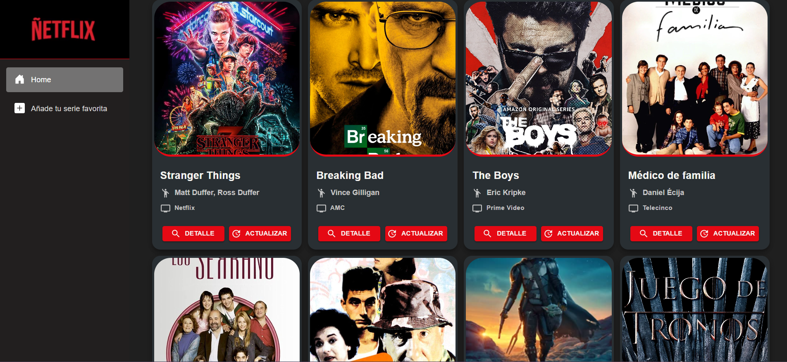
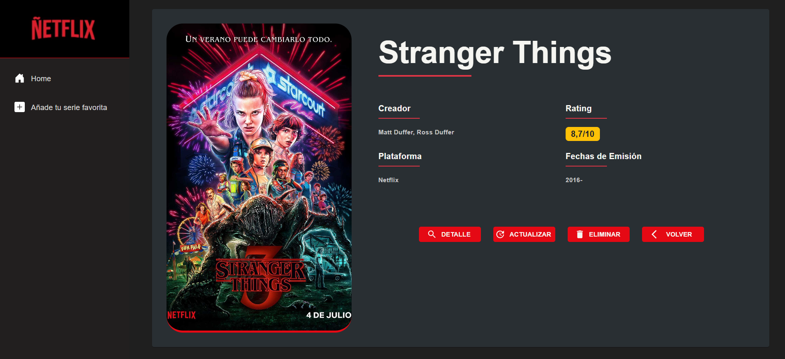
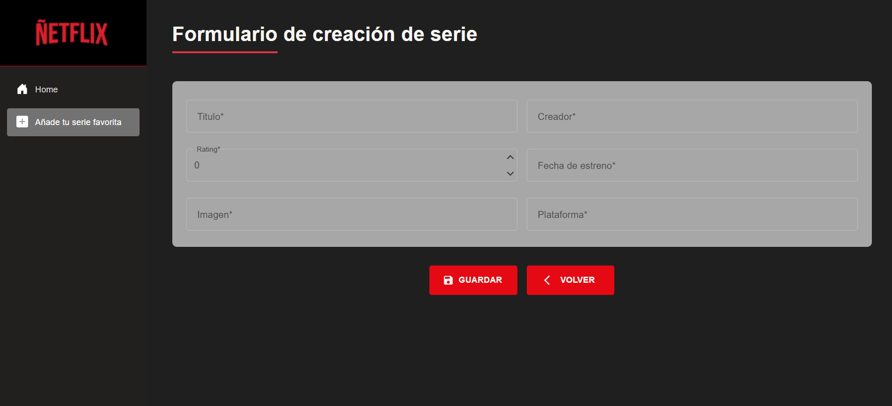

# Ñetflix -- Prueba de Migración Conceptual desde Angular a Blazor WebAssembly

Ñetflix es un proyecto experimental desarrollado para evaluar por
primera vez el flujo de trabajo en **Blazor WebAssembly**, aplicando
conceptos ya conocidos de Angular y trasladándolos al ecosistema **C#**,
**Razor Components** y **MudBlazor**.

El objetivo no es crear una aplicación final de producción, sino
**entender cómo se implementan en Blazor tareas típicas del frontend**:

-   Formularios y validación\
-   Servicios y llamadas HTTP\
-   Ciclo de vida con `async/await`\
-   Renderizado declarativo basado en componentes\
-   Interacción con APIs externas

Este proyecto funciona con una API muy simple que devuelve sus
respuestas mediante un `Console.WriteLine`. Esto es totalmente
intencional: la finalidad era **probar la conversión mental y técnica
desde Angular hacia Blazor**, no construir una API compleja.

------------------------------------------------------------------------

## 🎯 Objetivos del Proyecto

-   Realizar mi **primera aproximación a Blazor WebAssembly**.\
-   Analizar diferencias y similitudes respecto a Angular (especialmente
    en formularios y consumo de APIs).\
-   Usar el enfoque full-stack con C# tanto en servidor como en
    cliente.\
-   Experimentar con MudBlazor como framework de UI.\
-   Implementar CRUD simples para entidades de "Serie" utilizando
    formularios Blazor.

------------------------------------------------------------------------
## 🚀 Demo

**🔗 Demo en vivo:** [https://nextflis.adriancc.com/](https://nextflis.adriancc.com/)

------------------------------------------------------------------------
## 📸 Capturas de pantalla

### Página Principal


### Detalle de la serie


### Formulario actualización


------------------------------------------------------------------------

## 🧱 Estructura del Proyecto

El proyecto consta principalmente de:

### **Páginas (.razor)**

Ubicadas en:

    Ñetflix/Ñetflix/Pages/

Incluyen:

-   `Home.razor`
-   `CrearSerie.razor`
-   `ActualizarSerie.razor`
-   `VerDetalleSerie.razor`

Todas son componentes Blazor completos que integran:

-   UI con MudBlazor\
-   Formularios con `MudForm`\
-   Validación basada en modelo\
-   Inyección de servicios con `@inject`\
-   Llamadas asincrónicas a la API

### **Servicios**

Ubicados en:

    Ñetflix/Ñetflix/Services/

Ejemplo típico: `SeriesService.cs`.

### **Modelos**

Ubicados en:

    Ñetflix/Ñetflix/Models/

Incluyen DTOs para creación, detalle, actualización, etc.

### **UI**

Uso extensivo de **MudBlazor**, incluyendo:

-   `MudForm`
-   `MudTextField`
-   `MudSelect`
-   `MudButton`
-   `MudSnackbar`

------------------------------------------------------------------------

## 🔄 Migración Conceptual: Angular → Blazor

### 🧱 Componentes

  -----------------------------------------------------------------------
  Angular                     Blazor
  --------------------------- -------------------------------------------
  Componentes separados       Componente `.razor` único con UI + lógica
  (.ts + .html + .css)        C#

  Decoradores `@Component`    Directivas Razor `@page`, `@inject`,
                              `@code`

  Ciclo de vida (`ngOnInit`)  `OnInitializedAsync`, `OnAfterRenderAsync`
  -----------------------------------------------------------------------

------------------------------------------------------------------------

## 📋 Formularios: MudForm vs Angular Reactive Forms

Blazor + MudBlazor funciona mediante:

-   Modelos C# fuertemente tipados\
-   Binding con `@bind-Value`\
-   `MudForm` como contenedor\
-   Validación mediante atributos (`[Required]`, etc.)

Ejemplo:

``` razor
<MudForm @ref="_form" Model="@_serieCreateDto" OnValidSubmit="CrearSerieAsync">
    <MudTextField Label="Título" @bind-Value="_serieCreateDto.Titulo" />
    <MudTextField Label="Imagen" @bind-Value="_serieCreateDto.Imagen" />
    <MudNumericField Label="Puntuación" @bind-Value="_serieCreateDto.Puntuacion" />
    <MudButton Disabled="@_isLoading" ButtonType="ButtonType.Submit">
        Crear
    </MudButton>
</MudForm>
```

------------------------------------------------------------------------

## 🌐 HTTP Requests y async/await

Ejemplo real:

``` csharp
public async Task CrearSerie(SerieCreateDto dto)
{
    var response = await _http.PostAsJsonAsync("api/Series", dto);
}
```

------------------------------------------------------------------------

## 🖥 Consola como salida de la API

La API responde mediante `Console.WriteLine`, ya que la finalidad del
proyecto es **probar el flujo Blazor → API**, no procesar un retorno
complejo.

------------------------------------------------------------------------

## 🧪 Features Incluidas

-   Crear serie\
-   Actualizar serie\
-   Ver detalle\
-   Listar series\
-   Formularios MudBlazor\
-   Servicios async\
-   Notificaciones MudSnackbar

------------------------------------------------------------------------

## 🚀 Conclusiones de la Prueba

-   Blazor es muy accesible viniendo de Angular.\
-   El tipado unificado C# simplifica el desarrollo.\
-   MudBlazor mejora la productividad UI.\
-   `async/await` es más directo que Observables.\
